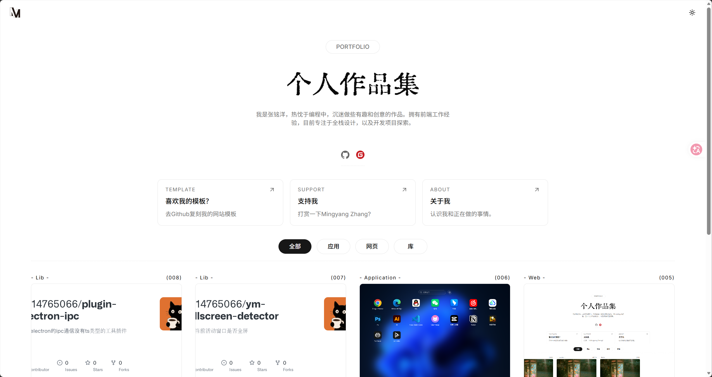

# Ym Portfolio

一个基于 Next.js、MDX 和 Tailwind CSS 的个人作品集模板。克隆后只需编辑 `src/content` 中的内容文件，即可快速生成自己的主页、关于页和文章列表，无需改动页面逻辑。

## 在线预览

[https://zhangmingyang.dpdns.org/](https://zhangmingyang.dpdns.org/)



## 开始使用

```bash
git clone https://github.com/2514765066/ym-portfolio.git
cd ym-portfolio
pnpm install
pnpm dev
```

开发服务器启动后，访问终端显示的本地地址。生产构建可使用：

```bash
pnpm build
pnpm start
```

## 内容目录

`src/content` 是模板的内容入口，以下结构是固定的：

```text
src/content/
├── home.mdx              # 主页信息与文章分类
├── about.mdx             # 关于页信息与正文
└── articles/             # 文章目录
    └── my-first-post.mdx
```

- `home.mdx`：必须存在，用于配置主页标题、简介、社交链接、快捷入口和文章分类。
- `about.mdx`：必须存在，用于配置 `/about` 页的标题信息及页面正文。
- `articles/`：必须存在；其中所有一级 `.mdx` 文件都会生成文章详情页，并显示在主页文章列表中。

文章文件名就是文章 ID，例如 `articles/my-first-post.mdx` 会生成 `/article/my-first-post/`。无需在 frontmatter 中手动填写 `id`。

主页文章会按 `updateTime` 日期**升序**排列，即日期较早的文章在前。请使用 `YYYY-MM-DD` 格式，避免出现不可预期的日期解析结果。主页分类根据文章的 `tag` 筛选，因此 `tag` 应与 `home.mdx` 中某个 `categories.value` 对应。

> `pdateTime` 应为 `updateTime`；项目当前使用的字段名是 `updateTime`。

## Frontmatter

每个 MDX 文件以 YAML frontmatter 开头，置于两行 `---` 之间。

### `home.mdx`

```mdx
---
tag: portfolio
title: 我的作品集
description: 一句简短的自我介绍。
links:
  - icon: /github.svg
    href: https://github.com/your-name
items:
  - tag: template
    title: 我的模板
    description: 查看源码和使用方式
    href: https://github.com/your-name/your-repo
categories:
  - label: 项目
    value: project
  - label: 文章
    value: article
---
```

| 字段          | 类型          | 必填 | 说明                                 |
| ------------- | ------------- | ---- | ------------------------------------ |
| `tag`         | `string`      | 是   | 主页顶部标签。                       |
| `title`       | `string`      | 是   | 主页主标题。                         |
| `description` | `string`      | 是   | 主页简介。                           |
| `links`       | `QuickLink[]` | 否   | 社交或外部链接。                     |
| `items`       | `ItemLink[]`  | 否   | 主页分类栏上方的快捷入口。           |
| `categories`  | `Category[]`  | 否   | 文章筛选分类；页面会自动提供“全部”。 |

### `about.mdx`

```mdx
---
tag: about
title: 关于我
description: 介绍你的经历、技能或联系方式。
links:
  - icon: /github.svg
    href: https://github.com/your-name
---

## 你好

这里可以直接编写 Markdown，也可以使用 MDX 组件。
```

| 字段          | 类型          | 必填 | 说明             |
| ------------- | ------------- | ---- | ---------------- |
| `tag`         | `string`      | 是   | 关于页顶部标签。 |
| `title`       | `string`      | 是   | 关于页主标题。   |
| `description` | `string`      | 是   | 关于页简介。     |
| `links`       | `QuickLink[]` | 否   | 社交或外部链接。 |

### `articles/*.mdx`

```mdx
---
tag: project
title: 我的第一个项目
description: 项目的简短介绍，会展示在主页卡片上。
updateTime: 2026-08-08
img: /article/my-first-post-cover.png
---

这里是文章正文。
```

| 字段          | 类型     | 必填     | 说明                                                            |
| ------------- | -------- | -------- | --------------------------------------------------------------- |
| `id`          | `string` | 自动生成 | 由文章文件名生成，用作详情页路由，无需手写。                    |
| `index`       | `number` | 自动生成 | 根据首页排序生成，用于显示文章编号，无需手写。                  |
| `tag`         | `string` | 是       | 文章类别；应对应 `categories.value`。                           |
| `title`       | `string` | 是       | 文章标题。                                                      |
| `description` | `string` | 否       | 主页文章卡片简介。                                              |
| `updateTime`  | `string` | 否       | 更新日期；用于首页排序，并显示在文章页顶部。推荐 `YYYY-MM-DD`。 |
| `img`         | `string` | 否       | 卡片封面图路径，通常放在 `public` 目录后以 `/` 开头引用。       |

### 嵌套类型

```ts
type QuickLink = {
  icon: string; // 图标路径，例如 /github.svg
  href: string; // 跳转地址
};

type ItemLink = {
  tag: string;
  title: string;
  description: string;
  href: string;
};

type Category = {
  label: string; // 页面显示名
  value: string; // 与文章 tag 对应的筛选值
};
```

## 写作能力

MDX 支持 GitHub Flavored Markdown、数学公式、代码高亮和标题锚点。文章详情页会自动生成目录。图片等静态资源请放入 `public`，再通过以 `/` 开头的路径引用。

## 常用命令

| 命令          | 用途                           |
| ------------- | ------------------------------ |
| `pnpm dev`    | 启动开发环境。                 |
| `pnpm build`  | 构建静态站点。                 |
| `pnpm start`  | 本地启动构建产物。             |
| `pnpm lint`   | 运行 ESLint。                  |
| `pnpm format` | 使用 Prettier 格式化项目文件。 |
